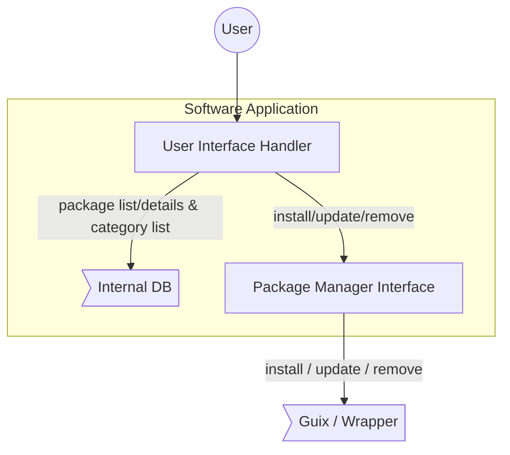
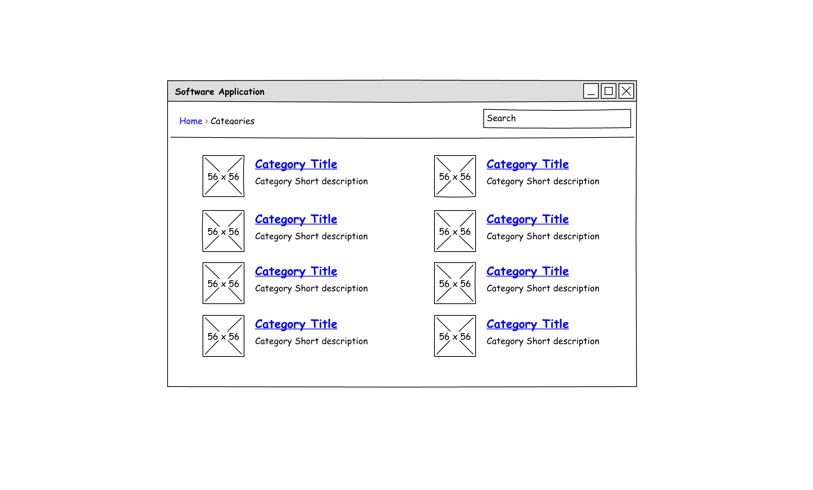
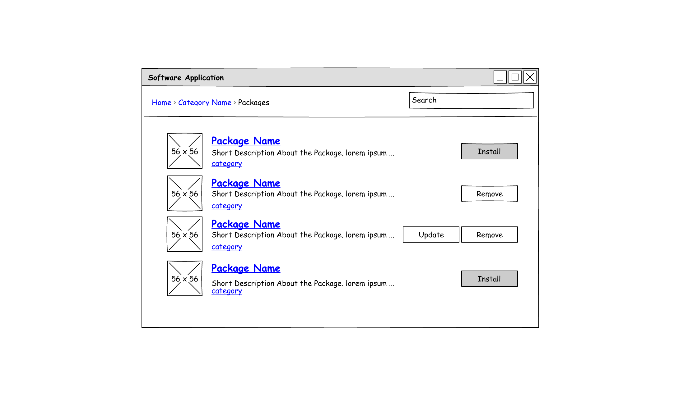
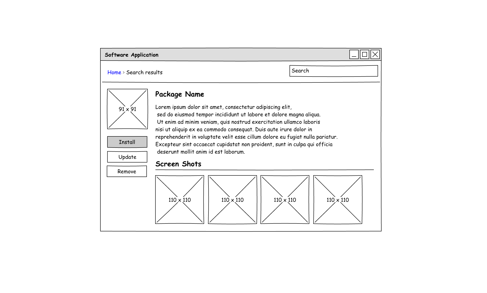

# PantherX Software Application

## Introduction

We introduce _Software Application_ as an easy to use interface provided for users to search and install softwares on PantherX. Users can search through all or specific _categories_  for a package, and could see package details and install it on their machine. they are also be able to update/remove already installed applications in their profile.

## Internal Implementation

_Software Application_ consist of following internal components:

1. _Interface Handler_, which is responsible for receiving user requests and provide proper response for them.
2. _Package Manager Interface_, which is responsible for translating user received requests to _Package Manager_ specific commands, execute them, and return back proper response to _User Interface_.

### Interface Handler

This component receive user commands from Interface and perform proper actions based on them. some of actions that need to be handled are:

#### 1. Category List

Grid View list of categories including _Title_, _Icon_ and _Short Description_.

#### 2. Package List

List View for packages including _Title_, _Icon_, _Category_ and _Short Description_.  this pages could be used to show list of packages inside a category or list of packages matching a search criteria.

#### 3. Provide *Details* of a specific package

Details View for a specific package including all available information about the package.

### Package Manager Interface

This component is responsible for receiving requests from interface and translate them to _Package Manager Specific_ commands, execute generated commands and transform results to the format that User interface understands.

Here is a list of _Package Manager Interface_ tasks:

1. Update Package Repositories
2. Provide List of installed Packages
3. Install New Package
4. Update Specific Package / List of Packages / All available updates
5. Remove already installed package

#### 1. Update Package Repositories

_Package Manager Interface_ need to have an interface that allows user to update list of package repositories manually. in _Guix_ we use `guix pull` command to perform this task.

#### 2. Provide List of installed Packages

_Package Manager Interface_ needs to have an interface to allow user interface to get list of installed packages. in _Guix_ we use `guix package --list-installed` command for this propose.

#### 3. Install New Package

_Package Manager Interface_ needs to have an interface to allow user interface to request for installing a new package. in _Guix_ we use `guix package install ...` command for this propose.

#### 4. Update Specific Package / List of Packages / All available updates

_Package Manager Interface_ needs to have an interface to update specific package, a list of packages or all packages installed in user profile. in _Guix_ we could update a package or list of packages by re-installing them. we could also update all available updates in user profile by usign `guix package -u` command.

#### 5. Remove already installed package

_Package Manager Interface_ needs to have an interface to allow user interface to remove a pacakge from user profile. in _Guix_ we use `guix package -r ...` command for this purpose.
