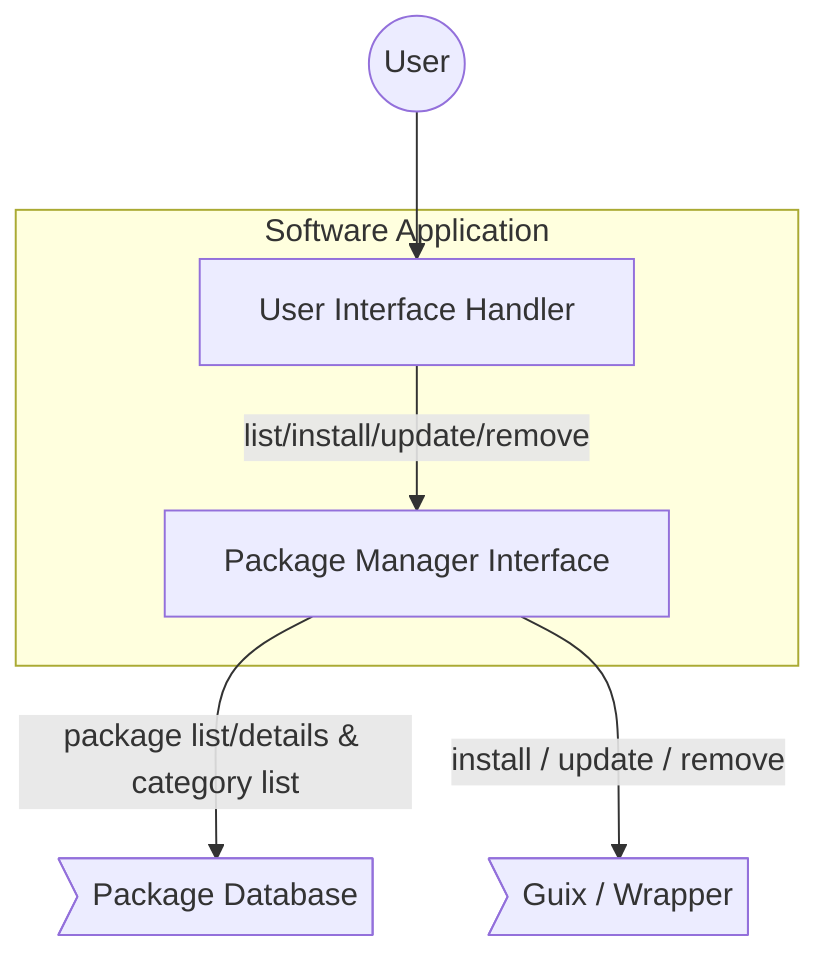

# PantherX Software Application

## Introduction

We introduce _Software Application_ as an easy to use interface provided for users to search and install softwares on PantherX. Users can search through all or specific _categories_  for a package, and could see package details and install it on their machine. they are also be able to update/remove already installed applications in their profile.

## Internal Implementation



_Software Application_ consist of following internal components:

1. _Interface Handler_, which is responsible for receiving user requests and provide proper response for them.
2. _Package Manager Interface_, which is responsible for translating user received requests to _Package Manager_ specific commands, execute them, and return back proper response to _User Interface_.

### Interface Handler

This component receive user commands from Interface and perform proper actions based on them. some of actions that need to be handled are:

#### 1. Category List

Grid View list of categories including _Title_, _Icon_ and _Short Description_.


#### 2. Package List

List View for packages including _Title_, _Icon_, _Category_ and _Short Description_.  this pages could be used to show list of packages inside a category or list of packages matching a search criteria.


#### 3. Provide *Details* of a specific package

Details View for a specific package including all available information about the package.


### Package Manager Interface

This component is responsible for receiving requests from interface and translate them to _Package Manager Specific_ commands, execute generated commands and transform results to the format that User interface understands.

Here is a list of _Package Manager Interface_ tasks:

1. Update Package Repositories
2. Provide List of installed Packages
3. Install New Package
4. Update Specific Package / List of Packages / All available updates
5. Remove already installed package
6. Search Packages based on specific criteria
7. Provide package details

#### 1. Update Package Repositories

_Package Manager Interface_ need to have an interface that allows user to update list of package repositories manually. in _Guix_ we use `guix pull` command to perform this task.

#### 2. Provide List of installed Packages

_Package Manager Interface_ needs to have an interface to allow user interface to get list of installed packages. in _Guix_ we use `guix package --list-installed` command for this propose.

#### 3. Install New Package

_Package Manager Interface_ needs to have an interface to allow user interface to request for installing a new package. in _Guix_ we use `guix package install ...` command for this propose.

#### 4. Update Specific Package / List of Packages / All available updates

_Package Manager Interface_ needs to have an interface to update specific package, a list of packages or all packages installed in user profile. in _Guix_ we could update a package or list of packages by re-installing them. we could also update all available updates in user profile by using `guix package -u` command.

#### 5. Remove already installed package

_Package Manager Interface_ needs to have an interface to allow user interface to remove a package from user profile. in _Guix_ we use `guix package -r ...` command for this purpose.

#### 6. Search Packages based on specific criteria

_Package Manager Interface_ needs to provide an interface to allow user interface to get list of packages based on provided search criteria. search operation could be performed on a specific category or search for packages that contain specific keyword inside.

#### 7. Provide package details

_Package Manager Interface_ needs to have an interface to allow user interface to get details for a specific package.

## Database
The Database of `PackageManager` is based on `recutils`. 

* The information of packages will be retrieved via `recsel` from Package Repo. (One `recfile` will be generated for each package)
* The `recfiles` will be store in PantherX Package Repo. 
* The `DB` will be update with a `guix pull` 
* The `px-software` access to `DB` locally from `~/.cache/guix/checkouts/[COMMIT]]/px/software/database/` path.
* The `px-software` read the `recfiles` with `librec` in C.

### Structure:
There is a sample DB folder as the structure. [link](https://git.pantherx.org/development/applications/px-software/-/tree/master/SAMPLE_DB)

### URL scheme
`px-software` could be run by `px-software:...` url for openning specific list or specific application page.
```
px-software:list=user_updates
```
```
px-software:app=featherpad
```

---

## Update Check Guile Script

We're using the `px-software-update-check` guile script for retrieving the user/system upgradable package list. [here](https://git.pantherx.org/development/applications/px-software/-/tree/master/script)

* getting the user upgradable package list:
```bash
$ px-software-update-check
```

* getting the system upgradable package list:
```bash
$ px-software-update-check system
```

The output data structure is:
```
package_name:old_version>new_version
```


Example:
```bash
gnutls:3.6.9>3.6.A
eudev:3.2.9>3.2.9-1
guile:2.2.6>2.2.7
guix:1.0.1-15.a941cec>1.0.1-15.a941cec
```

---


# Add Software to DB

**Instructions**

1. Clone the `guix-pantherx` from [here](https://git.pantherx.org/development/guix-pantherx)
2. Create script as follow (`add_to_db.sh`):

```bash
#!/bin/sh
if [ "$#" -ne 3 ]; then
   echo "Usage: $0 <package> <category> <dbPath>"
   exit 1
fi

package_name=$1
category=$2
dbPath=$3
guix package -s $package_name | recsel -e "name = '$package_name'" > _package.rec

if [ -s _package.rec ]; then
   name=$(recsel -n 0 -P name _package.rec)
   title=$name
   version=$(recsel -n 0 -P version _package.rec)
   description=$(recsel -n 0 -P description _package.rec)
   homepage=$(recsel -n 0 -P homepage _package.rec)
   license=$(recsel -n 0 -P license _package.rec)
   #echo $name $title $version $description $homepage $license $category
   rm _package.rec
   file_name=$package_name".rec"
   > $file_name
   recins -f name -v $name -f title -v "$title" -f version -v $version -f description -v "$description" -f homepage -v $homepage -f license -v "$license" -f category -v $category $file_name
   sed -i '1i # -*- mode: rec -*-' $file_name
   mv $file_name $dbPath
   exit 0
fi
rm _package.rec
echo "$package_name not found"
exit 1
```

3. change `add_to_db.sh` mode as executable.
4. run as follow:
```bash
$ ./add_to_db.sh <package_name> <category> <PATH>/guix-pantherx/px/software/database/packages/
```
 Example:
 ```bash
$ ./add_to_db.sh telegram-desktop communication guix-pantherx/px/software/database/packages/
 ```
5. A `rec` file will be added in the `<PATH>/guix-pantherx/px/software/database/packages/<package_name>.rec`.
6. Add the above `rec` file to `guix-pantherx` repo and commit.
7. After merging to `master` and `guix pull`, this package will be shown in `px-software`.

**Note:**
 * The `icon` and `screenshot` fields won't be filled by above script and you should add and fill them manually.
 * `Category` list: name: `development`, `finance`, `communication`, `education`, `entertainment`, `games`, `music`, `photography`, `utilities`, `browser`.
 * You can Add new Category, for this the `category.rec` file should be updated: `<PATH>/guix-pantherx/px/software/database/`