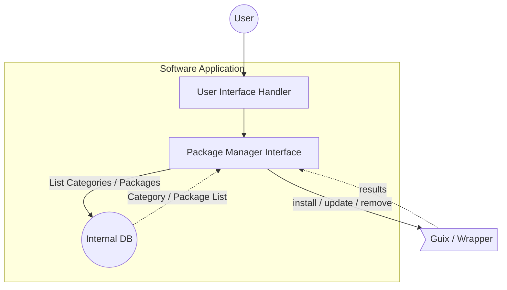

## Introduction

We introduce _Software Application_ as a easy to use interface provided for users to search and install softwares on PantherX. Users can search through all or specific _categories_  for a package, and could see package details and install that on their machine. they also are able to update/remove already installed applications in their profile. 

## Internal Implementation

_Software Application_ consist of following internal components: 

1. _Interface Handler_, which is responsible for receiving user requests and provide proper response for them.
2. _Package Manager Interface_, which is responsible for translating user received requests to _Package Manager_ specific commands, execute them, and return back proper response to _User Interface_. 

### Interface Handler 

This components receives user commands from Interface and perform proper actions based on them. some of actions that need to be handled are:
1. Provide *List of Categories*
2. Provide *List of Packages* inside a category
3. Provide *Details* of a specific package
4. Perform *Search* operation

### Package Manager Interface

This component is responsible for receiving user requests and translate them to _Package Manager Specific_ commands, execute them and transform results to the format that User interface understands. 

## User Interface Parts
We need following interfaces for _Software Application_: 
1. Category List
2. Package List
3. Package Details

### Category List
Grid View list of categories including _Title_, _Icon_ and _Short Description_.

### Package List 
List View for packages including _Title_, _Icon_, _Category_ and _Short Description_.  this pages could be used in both category packages or search results.

### Package Details
Details View for a specific package including all available information about the package. 

## Package Manager Interface

Main responsibility for _Package Manager Interface_ is to receive standard requests from users and convert them to package manager related commands. _Package Manager Interface_ also converts command execution responses to standard format that _User Interface_ understands. 

Here is a list of _Package Manager Interface_ tasks: 
1. Get list of categories
2. Get list of packages, matching with specified filters. (filters could be a wildcard string or a specific category)
3. Get package details
4. Install / Update / Remove specific package
5. Update all installed packages
